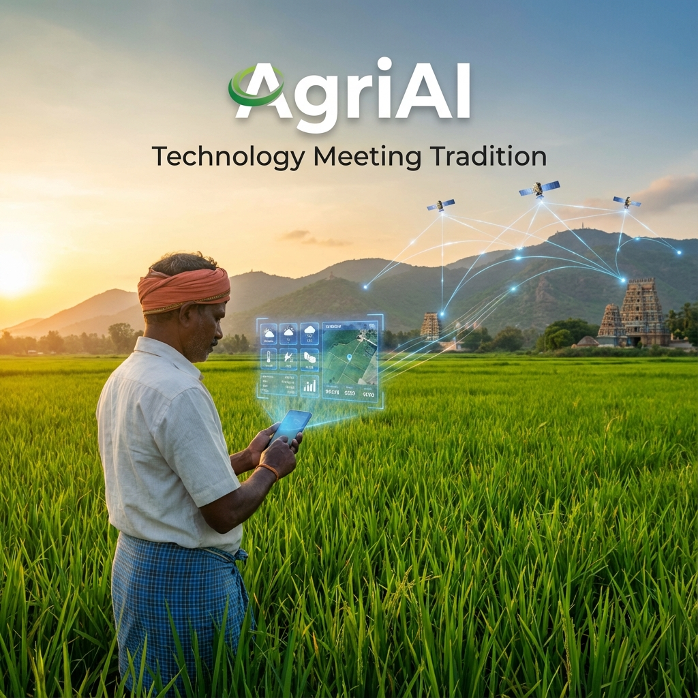

# 🌾 AgriAI: The Intelligent Farming Companion (Next-Gen)



👉 **[Live Demo (React Face)](https://agri-ai-gamma.vercel.app)**

AgriAI is a professional-grade, microservices-based agricultural platform designed for Tamil Nadu. It blends cutting-edge AI (Satellite monitoring, Disease Detection) with deep cultural wisdom, now powered by a modern React frontend and a robust Node.js API.

---

## 🏗️ Architecture: Professional Microservices

The platform uses a scalable, containerized architecture:

1.  **Frontend (Face)**: [React + Tailwind](https://github.com/haroon2109/AgriAI/tree/main/frontend_react) for a premium, responsive UI.
2.  **Core API (Heart)**: [Node.js + Express](https://github.com/haroon2109/AgriAI/tree/main/backend_node) (JWT Auth, E-commerce, ML Proxy).
3.  **ML Backend (Brain)**: [FastAPI](https://github.com/haroon2109/AgriAI/tree/main/backend_api) (Yield Prediction, Disease Risk).
4.  **Database**: PostgreSQL (Supabase) for users, products, and analytics.

---

## 🚀 How to Run (Local Docker)

The easiest way to run the entire stack (App, API, ML, and DB) locally:

1.  **Clone the Repo**:
    ```bash
    git clone https://github.com/haroon2109/AgriAI.git
    cd AgriAI
    ```

2.  **Run with Docker**:
    ```bash
    docker-compose up --build
    ```

3.  **Access Points**:
    -   **Frontend**: http://localhost:3000
    -   **Core API**: http://localhost:5000/api
    -   **ML Docs**: http://localhost:8000/docs

---

## ✨ Key Features

-   **🤖 AI Advisor**: Real-time advice and market updates.
-   **🌿 Disease Scanner**: Mobile-first crop health diagnosis.
-   **🗺️ Yield Forecaster**: Satellite-powered regional yield mapping.
-   **💰 Agri-Market**: Secure shop for fertilizers and tools.
-   **☀️ Sunlight Mode**: Ultra-high contrast UI for direct sunlight use.

---

## 📂 Project Structure

-   `frontend_react/`: Modern React dashboard.
-   `backend_node/`: Central Node.js API (The "Heart").
-   `backend_api/`: Machine Learning Service (The "Brain").
-   `legacy_archive/`: Original Streamlit prototype for historical reference.

---
*Built with ❤️ for the farmers of Tamil Nadu.*
